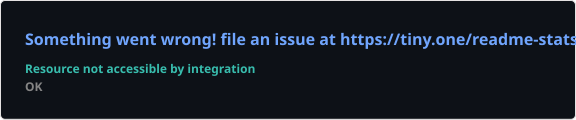

<!-- ===================== HEADER BANNER ===================== -->

  

  

  
  
  
  
  

---

<!-- ===================== ABOUT + SKETCH ===================== -->
## 👩‍💻 About Me

I'm a **Senior Software Engineer** with **5+ years** of professional experience, focused on frontend and full-stack web engineering.

- 💼 Senior Software Engineer at **Technovative Solutions Ltd.**
- ⚛️ Strong in **React, Next.js, TypeScript** & modern frontend architecture
- 🔧 **Node.js, Express, NestJS, REST APIs, PostgreSQL, MongoDB**
- ☁️ **AWS, Docker, CI/CD, Redis, Nginx** & production deployments
- 🧩 Into **clean architecture, system design & performance**
- 🎓 Pursuing an **MSc in Computer Science & Engineering**
- 🧠 Research: **Crime Hotspot Detection — Spatio-Temporal Pattern Recognition**
- 🤖 Exploring **AI agents & automation** in engineering workflows

 

---

## 💼 Professional Experience

| Role | Company | Period |
| :--- | :--- | :--- |
| **Senior Software Engineer** | Technovative Solutions Ltd. | Dec 2025 – Present |
| **Senior Software Engineer** | Cosmos Tech Labs | May 2024 – Nov 2025 |
| **Senior Software Engineer** | Bloclabs | May 2024 – Jul 2025 |
| **Software Engineer** | BJIT Group | Mar 2021 – May 2024 |

<b>🔍 What I work with professionally</b> (click to expand)

 

**Frontend** — React, Next.js, TypeScript, Redux Toolkit, Zustand, Tailwind CSS, Material UI, Ant Design, React Hook Form, Zod
**Backend** — Node.js, Express.js, NestJS, REST APIs, authentication, background jobs, integrations
**Data & Storage** — PostgreSQL, MongoDB, Prisma, Sequelize, Redis
**Cloud & DevOps** — AWS, Docker, Nginx, PM2, CI/CD, Vercel, Firebase, monitoring
**Practices** — Reusable architecture, testing, debugging, performance optimization, documentation, code review

---

## 🛠️ Tech Stack

<b>Frontend</b>

<b>Backend & Database</b>

<b>Cloud, DevOps & Tools</b>

<b>Data Science & ML — currently learning</b>

> My primary professional identity is **Software Engineering**. Data Science, ML and Pattern Recognition are areas I'm actively learning through my MSc studies and research.

---

## 🚀 Featured Engineering Work

<table>
<tr>
<td width="50%" valign="top">

### 🧠 Crime Hotspot Detection
Spatio-temporal pattern recognition on historical crime data using symbolic sequences, grammar-based patterns and explainable risk indicators.

`Next.js` `TypeScript` `FastAPI` `Python`

[Frontend](https://github.com/TanjilaShamima/crime-hotspot-detect-frontend) · [Backend & Research](https://github.com/TanjilaShamima/crime-hotspot-detect-backend)

</td>
<td width="50%" valign="top">

### ⚡ Parallel Server Log Analyzer
Compares sequential vs parallel server-log processing with Node.js worker threads, benchmarking and live SSE observability.

`Next.js` `Node.js` `Worker Threads` `SSE`

[Frontend](https://github.com/TanjilaShamima/parallel-server-log-analyzer-fe) · [Backend](https://github.com/TanjilaShamima/parallel-server-log-analyzer-be)

</td>
</tr>
<tr>
<td width="50%" valign="top">

### 🔐 Backend Authentication Service
Authentication and user management with Node.js, Express, PostgreSQL and AWS S3.

`Node.js` `Express` `PostgreSQL` `AWS S3`

[View Repository](https://github.com/TanjilaShamima/BE-Auth-Service-Express-Node-Js-postgres-S3)

</td>
<td width="50%" valign="top">

### 📊 Machine Learning Journey
Structured learning repo covering ML concepts, data analysis, model evaluation and experiments alongside my MSc.

`Python` `ML` `Data Analysis`

[View Repository](https://github.com/TanjilaShamima/machine-learning-journey)

</td>
</tr>
</table>

---

## 🏆 Achievements

- 🥉 **2nd Runner-up** — DIU Intra University Girls Programming Contest
- 🏅 **6th Position** — DIU Intra University Math Olympiad
- 💻 Participated in **National Girls Programming Contest** & **ICPC Mock Contest**
- 🧠 Solved hundreds of problems across multiple online judges

---

## 📊 GitHub Analytics

  
  

  

### 🧊 3D Contribution Graph

  <picture>
    <source media="(prefers-color-scheme: dark)" srcset="./profile-3d-contrib/profile-night-rainbow.svg">
    
  </picture>

### 📈 Languages & Coding Habits

  
  

  
  

### 🐍 Contribution Snake

  <picture>
    <source media="(prefers-color-scheme: dark)" srcset="https://raw.githubusercontent.com/TanjilaShamima/TanjilaShamima/output/github-snake-dark.svg">
    
  </picture>

---

## 🤝 Let's Connect

I'm open to conversations around **software engineering, scalable web platforms, frontend/backend architecture, cloud systems, AI-assisted development and research-oriented engineering**.

  
  
  

<!-- ===================== FOOTER ===================== -->

  

